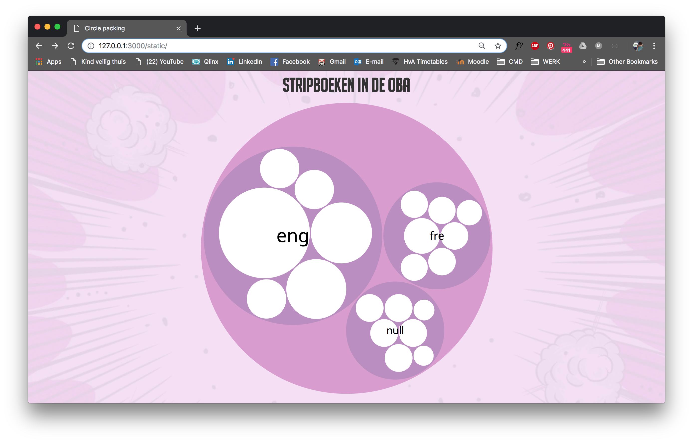

# Frontend-data



## Table of contents

* [Installation](#installation)
* [Introduction](#introduction)    
* [Process](#process)   
* [Data](#data)    
  * [API](#API)    
  * [Code](#code)   
* [Todo](#todo)
* [Credits](#credits)
  * [Resources](#resources)
* [License](#license)

## Installation


## Introduction

I made a datavisualisation about comic books in the public library of Amsterdam (OBA). I used the `OBA API` to collect the data. Read more about the data and code in `Data`.

## Process

During this project I learned a lot about **D3**, working with **data** and **data visualizations** in general. I also did a lot more than you can tell from my visualization. I documented my process in `process.md`, here you can find all the progress I made during this project. I also documented everything I tried to do, but failed to, and all the steps I made to come to this point.

I must say I'm not very proud of my data visualization. I'm happy I managed to get something in D3, but it is far from what I imagined it to be. Check `process.md` for more information.

## Data

* `d3.nest()` used to structure my data in D3.
* `.map` sort of 'loop', generates an array with data
* `.split('/')` use to cut the string at the '/'
* `.trim()` use to cut spaces off both sides
* `Number()` used to covert the totalPages string to a number

### API

Create a `.env` file to store the keys, your file should look like this;

```
PUBLIC=1e19898c87464e239192c8bfe422f280
SECRET=4289fec4e962a33118340c888699438d
```

Use `npm install` to install `@gijslaarman/oba-scraper`, require the API in your index.js file. To create a connection to the API you need the `PUBLIC key` you stored in your `.env` file.

```js
const api = require("@gijslaarman/oba-scraper")
const client = new api({
    publicKey: process.env.PUBLIC
})
```

 * `endpoint` -> define the endpoint used in the API
 * `query` -> define the things you want to look for
 * `pages` -> define the number of pages you want to get

```js
const search = {
    endpoint: 'search',
    query: {
        q: 'format:book',
        facet: 'genre(stripverhaal)',
        sort: 'year',
        librarian: true,
        refine: true
    },
    pages: {
        page: 1,
        pagesize: 20,
        maxpages: 1
    },
}
```

### Code
* `title`, `illustrator`, `otherAuthors`, `subject`, `pages` etc. -> Labels for collected data
*

This is a piece of code from `server/index.js`. This is where I collect my data from the API and perform checks.
```js
const data = response.map(book => (
  {
    title: book.titles && book.titles[0] && book.titles[0].title && book.titles[0].title[0] ? book.titles[0].title[0]._.split('/')[0].trim() : null,
    genres: book.genres && book.genres[0] && book.genres[0].genre ? book.genres[0].genre[0]._ : "overig",
    originalLanguage: book.languages && book.languages[0] && book.languages[0]['original-language'] ? book.languages[0]['original-language'][0]['_'] : null,
    totalPages: book.description && book.description[0] && book.description[0]["physical-description"] && book.description[0]["physical-description"][0] ? Number(book.description[0]["physical-description"][0]._.split(' ')[0]) : null
  }
))
```

## Todo

- [x] Write (english) README.md
- [x] Fix `table-of-contents`
- [x] Connect to API, write data to data.json
- [x] Create `D3` data visualization (part of data)
- [ ] Add new layer in data visualization
- [ ] Update data visualization to complete dataset (+/- 7000 books)
- [ ] Filter data, turn on and off
- [x] Try faking-it-till-you-making-it (data manipulation)
  - [x] Still fail...
- [x] Document process in `process.md`
- [x] Clean up code, functional
- [x] Add styling
- [ ] Use `npm delve` to replace my massive checks in server/index.js

## Credits

Titus Wormer `@wooorm`    
Folkert-Jan vd Pol `@FJvdP`    
Dennis Wegereef `@Denniswegereef`    
Gijs Laarman `@gijslaarman`    
Tim Ruiterkamp `@timruiterkamp`

### Resources

* [Datavizcatalogue](https://datavizcatalogue.com/)    
  * [Circle packing method](https://datavizcatalogue.com/methods/circle_packing.html)   
  * [Tree map method](https://datavizcatalogue.com/methods/treemap.html)    
* [D3 nest](http://learnjsdata.com/group_data.html)
* [D3 layouts](https://d3indepth.com/layouts/)
* [D3 hierarchy](https://github.com/d3/d3-hierarchy )   
* [Youtube tutorial](https://www.youtube.com/watch?v=Z0PpaI0UlkE)  
* [Circle packing example by Mike Bostock](https://bl.ocks.org/mbostock/7607535)
* [Observablehq  example](https://beta.observablehq.com/@mbostock/d3-circle-packing)   
* [Gissa oba scraper](https://www.npmjs.com/package/@gijslaarman/oba-scraper)   
* [Daniel vd Velde README.md](https://github.com/DanielvandeVelde/functional-programming#cheatsheet)
* [README.md example by Titus](https://github.com/wooorm/dictionary)

## License

MIT © Luna May Johansson
