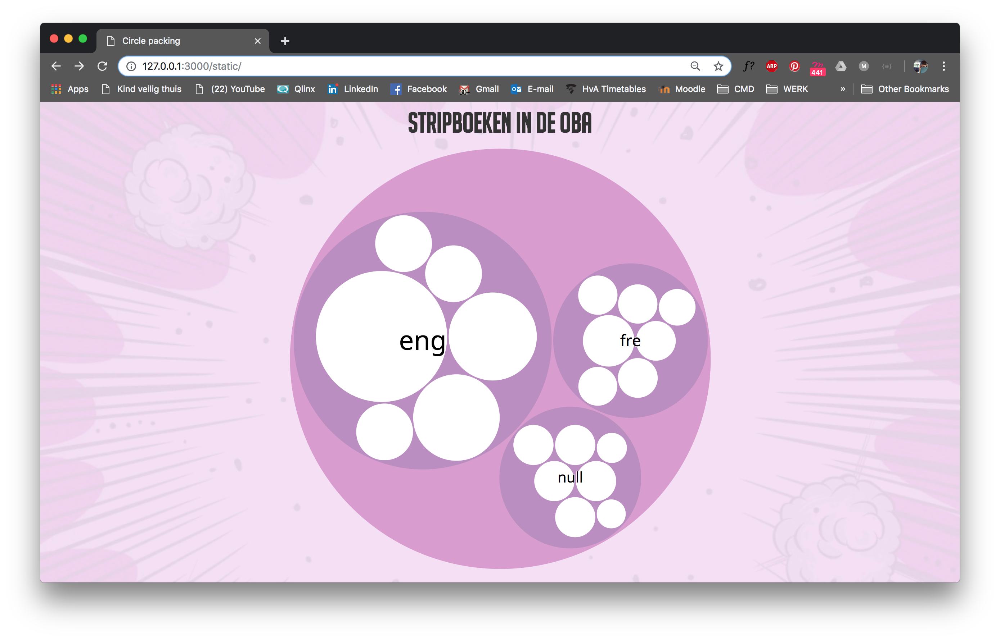

# Frontend-data



## Table of contents

* [Installation](#installation)
* [Introduction](#introduction)    
* [Process](#process)   
* [Data](#data)    
  * [API](#API)    
  * [Code](#code)   
* [To do](#todo)
* [Credits](#credits)
  * [Resources](#resources)
* [License](#license)

## Installation


## Introduction

I made a datavisualisation about comic books in the public library of Amsterdam (OBA). I used the `OBA API` to collect the data. Read more about the data and code in `Data`

## Process

I used `D3` and everything I learned with functional programming to create a datavisualisation. The circle packing I made turned out to be a bit harder than I thought.

At first I thought I needed to structure my data in the server, but this was wrong. Now I just collect the data I need and add the structure in D3. This makes it possible to add a size value which is needed to calculate the depth of the 'bubble'. I'm using `d3.nest()` to structure the data. Because I need to go deeper into the bubbles every time, I need to nest inside my nest. This works; I am able to show genre-bubbles with my books inside.

Now I need a new layer. I need my books to be inside the genre-bubbles INSIDE a language bubble. This way I can visualize genres inside (original) language, and show my books per genre. If this works I am able to add a filter, so the user can choose to either see books per genre per language or just books per language. Not very interesting, but it's the best I can do...

I struggled a lot to get the bubbles working. Titus and Folkert helped me a lot and we eventually managed to get it to work. Now I'm struggling to get my data structure right... I haven't even gotten started on the interaction part...

## Data

* `d3.nest()` -> used to structure my data in D3.
* `.map` ->
* `.split('/')` -> use to cut the string at the '/'
* `.trim()` -> use to cut spaces off both sides
* `Number()` -> used to covert the totalPages string to a number

### API

Create a `.env` file to store the keys, your file should look like this;

```
PUBLIC=1e19898c87464e239192c8bfe422f280
SECRET=4289fec4e962a33118340c888699438d
```

Use `npm install` to install `@gijslaarman/oba-scraper`, require the API in your index.js file. To create a connection to the API you need the `PUBLIC key` you stored in your `.env` file.

```js
const api = require("@gijslaarman/oba-scraper")
const client = new api({
    publicKey: process.env.PUBLIC
})
```

 * `endpoint` -> define the endpoint used in the API
 * `query` -> define the things you want to look for
 * `pages` -> define the number of pages you want to get

```js
const search = {
    endpoint: 'search',
    query: {
        q: 'format:book',
        facet: 'genre(stripverhaal)',
        sort: 'year',
        librarian: true,
        refine: true
    },
    pages: {
        page: 1,
        pagesize: 20,
        maxpages: 1
    },
}
```

### Code
* `title`, `illustrator`, `otherAuthors`, `subject`, `pages` etc. -> Labels for collected data
*

This is a piece of code from `index.js`. This is where collect my data from the API.
```js
const data = response.map(book => (
  {
    title: book.titles && book.titles[0] && book.titles[0].title && book.titles[0].title[0] ? book.titles[0].title[0]._ : null,
    illustrator: book.authors && book.authors[0] && book.authors[0]["main-author"] && book.authors[0]["main-author"][0] ? book.authors[0]["main-author"][0]._ : null,
    otherAuthors: book.authors && book.authors[0] && book.authors[0].author ? book.authors[0].author.map(author => ({author: author._})) : null,
    subject: book.subjects && book.subjects[0] && book.subjects[0]["topical-subject"] && book.subjects[0]["topical-subject"][0] ? book.subjects[0]["topical-subject"][0]._ : null,
    genres: book.genres && book.genres[0] && book.genres[0].genre ? book.genres[0].genre.map(genre => ({genre: genre._})) : null,
    language: book.languages && book.languages[0] && book.languages[0].language && book.languages[0].language[0] ? book.languages[0].language[0]['_'] : null,
    originalLanguage: book.languages && book.languages[0] && book.languages[0]['original-language'] ? book.languages[0]['original-language'][0]['_'] : null,
    publisher: book.publication[0] && book.publication[0].publishers[0] && book.publication[0].publishers[0].publisher[0] ? book.publication[0].publishers[0].publisher[0]._ : null,
    place: book.publication && book.publication[0] && book.publication[0].publishers && book.publication[0].publishers[0] && book.publication[0].publishers[0].publisher && book.publication[0].publishers[0].publisher[0] ? book.publication[0].publishers[0].publisher[0].$.place : null,
    year: book.publication && book.publication[0] && book.publication[0].year && book.publication[0].year[0]['_'] ? book.publication[0].year[0]['_'] : null,
    totalPages: response.description && response.description[0] && book.description[0]["physical-description"] && book.description[0]["physical-description"][0] ? book.description[0]["physical-description"][0]._ : null
  }
))
```

## To do

- [x] Write (english) README.md
- [x] Fix `table-of-contents`
- [ ] Write `Installation`, `API` and `Process`
- [ ] Finish `Data`, `Code`, `Credits`, `Resources` and `License`
- [ ] Fix code-snippet in `Code`
- [x] Connect to API (functional-programming)
- [x] Generate data, write to data.json
- [x] Create `D3` data visualization (part of data)
- [ ] Add new layer in data visualization
- [ ] Update data visualization to complete dataset (+/- 7000 books)
- [ ] Filter data, turn on and off
- [ ] Clean up code, functional

## Credits

Titus Wormer `@wooorm`    
Folkert-Jan vd Pol `@FJvdP`    
Dennis Wegereef `@Denniswegereef`    
Gijs Laarman `@gijslaarman`

### Resources

* [Datavizcatalogue](https://datavizcatalogue.com/)    
  * [Circle packing method](https://datavizcatalogue.com/methods/circle_packing.html)   
  * [Tree map method](https://datavizcatalogue.com/methods/treemap.html)    
* [D3 nest](http://learnjsdata.com/group_data.html)
* [D3 layouts](https://d3indepth.com/layouts/)
* [D3 hierarchy](https://github.com/d3/d3-hierarchy )   
* [Youtube tutorial](https://www.youtube.com/watch?v=Z0PpaI0UlkE)  
* [Circle packing example by Mike Bostock](https://bl.ocks.org/mbostock/7607535)
* [Observablehq  example](https://beta.observablehq.com/@mbostock/d3-circle-packing)   
* [Gissa oba scraper](https://www.npmjs.com/package/@gijslaarman/oba-scraper)   
* [Daniel vd Velde README.md](https://github.com/DanielvandeVelde/functional-programming#cheatsheet)
* [README.md example by Titus](https://github.com/wooorm/dictionary)

## License

MIT © Luna May Johansson
