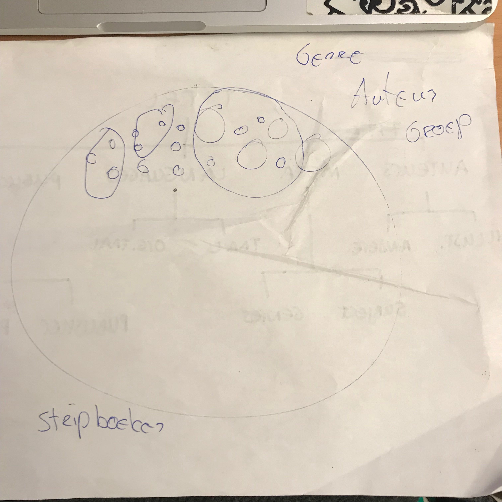
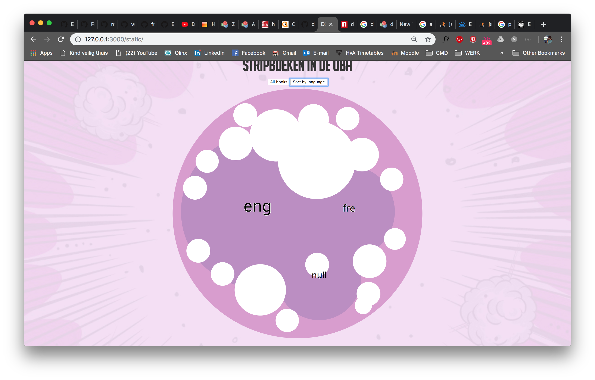
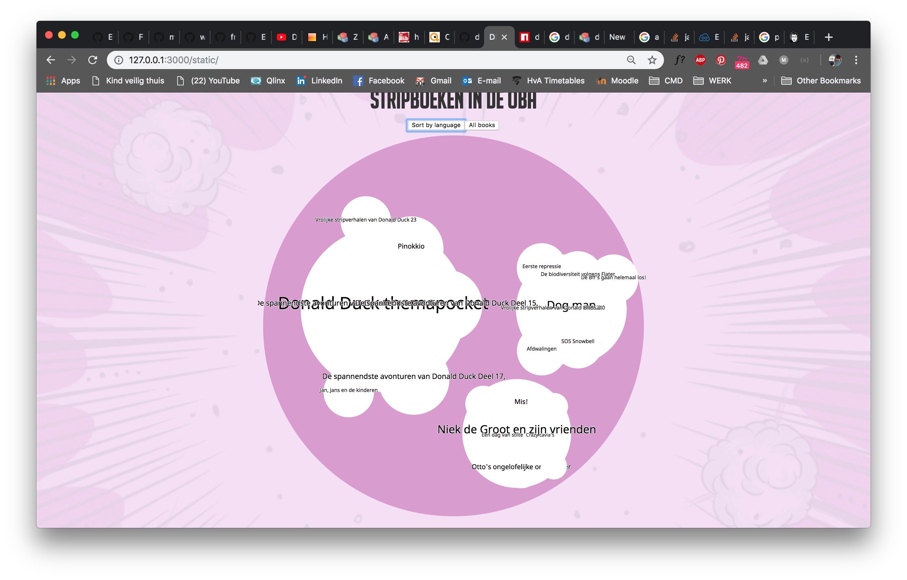

# Process


## Table of contents

* [Important](#important)
* [Concept](#concept)
* [API](#api)
* [Data](#data)
* [Circle packing](#circle-packing)
* [D3](#d3)
  * [Nesting](#nesting)
  * [Interaction](#interaction)

## Important

* `try/previous.js` (mentioned in data) contains my initial data-structure, which I wrote to data.json
* `Mike's Zoomable Circle Packing` (mentioned in D3) refers to Mike Bostock's circle pack example. `try/mike_example.html` shows his code

## Concept

For this project I chose to visualize comic books for the public library of Amsterdam (OBA). At first I wanted to create a map to show where comic books are written and/or published and where the writers are from. After I while I stuck with circles and such and came up with a circle packing.

At first I thought I needed to structure my data in the server, but this was wrong. I managed to write code to collect the data in objects in objects in objects and spread arrays into different objects. I thought I could just create bubbles for everything and nest them into different objects. I didn't think of a size or a value to use as a scale... After I sat with Titus he told me I should just collect the data I need and add the structure in D3 using `nest`. This makes it possible to add a size value which is needed to calculate the depth of the 'bubble'.

Titus also drew this out for me;



## API

At the beginning of `frontend-data` I started to understand the OBA API more and more. I played with it for a few days; collecting different data, bigger amounts of data and adding structure. I also tried out different API's created by my fellow students. At first I used Folkert-Jan and Dennis their API. Eventually Gijs managed to write a scraper in which we could define a maximum pages. This made it possible to collect all the data at once. He even made a npm package, which is the one I used in the end.

Because everyone kept changing their API scraper things, I had to constantly update this. I eventually thought of a subject that I thought was most 'complete' and would generate fun data (such as publishers, years, places etc.).

Gijs initially wrote his scraper for himself. This is the reason I'm using these enormous checks; to make sure I always get the right data and make sure there is data to get in the first place.

## Data

I spend a lot of time structuring my data in my `server/index.js` because I thought I needed this structure in my .json file. This was not the case

## Circle packing

I used `D3` and everything I learned with functional programming to create a data visualization. The circle packing I tried to make turned out to be a bit harder than I thought. Due to miscalculations and mistakes concerning my concept I was trying to create something 'impossible'... Luckily I managed to come up with a usable concept so I could go on with my plan.

## D3

I must say D3 is still a bit much for me... Sometimes it works, sometimes it doesn't and most of the time I don't really know why... I also started working with circles this time, instead of rectangles (my previous chart was a bar chart). I also chose a visualization that none of my fellow students had ever made. One of the only good examples was my Mike Bostock, but this was lacking background information...

After trying for with Folkert and Dennis for 2 days I asked Titus to help me out and he did. We took `Mike's Zoomable Circle Packing` and started working from there. It still took us a while but we got it!! After that I could start on my visualization (finally...)

### Nesting

Dennis and Tim helped me a lot. I started the nesting process in `const sortByLanguage`. Usually a nest results in `keys` and `values`. I need a different structure, I need `names` and `children`. To get these, I need to `map` and change the keys and values to names and children. This structure is needed to create my circle packing.

Dennis and I managed to get a layer. Languages which contain all the books. This was a good start, but I needed/wanted a new layer. This turned out to be much harder than I thought... I need my books to be inside the genre-bubbles INSIDE a language bubble. This way I can visualize genres inside (original) language, and show my books per genre. If this works I am able to add a filter, so the user can choose to either see books per genre per language or just books per language. Not very interesting, but it's the best I can do...

I eventually gave up on the genre part... Tim and I spend way too long on this nesting-hell. Dennis and Folkert didn't even want to try anymore because it was too hard. I managed to map the data into language-arrays that contained genres, but somewhere something went wrong and we ended up with too much arrays with data... So we gave up...

### Interaction

After I gave up on getting another layer (genres), I tried adding some interaction. At first I thought I could use this 'extra' layer as a filter. I could add a button to turn the genre-filter on or off and the circles would change position. But because the genre-layer was no success, I tried doing this with the languages. I tried turning these language-bubbles on and off but this was no success either... Folkert-Jan helped me set this up. I knew I had to manipulate the data using `d3.enter()`, `.exit()` and `.update()` to change and update the data. I also knew that in my case this meant changing the hierarchy data and switch it from `dataBooks` (shows all the books) to `dataLanguage` (shows books per language).

```js
const dataLanguage = sortByLanguage.map(data => {
  return { name: data.key, children: sortByLanguage }
})[0]

const dataBooks = sortByLanguage.map(data => {
  return { name: data.key, children: result }
})[0]

// "..." is the part that needs to change
const root = d3.hierarchy(...)
  .sum(d => d.totalPages)
  .sort((a, b) => b.value - a.value)
```
As Folkert was helping me, we came to the conclusion that this would be hard to add to my code at this stage, because I had to add functions and render data and this would mean I had to declare everything again somewhere else in my file...

So I started faking-it-till-I-was-making-it! At first I thought this would work, so I could at least show you what I planned to do. It kind of worked... I managed to append a button, than I switched to a dropdown, than back to a button again... I wanted to connect the different hierarchies to a value of either a dropdown-option or a button, but this messed the whole thing up... I tried fixing this for a couple of hours until finally giving up...



